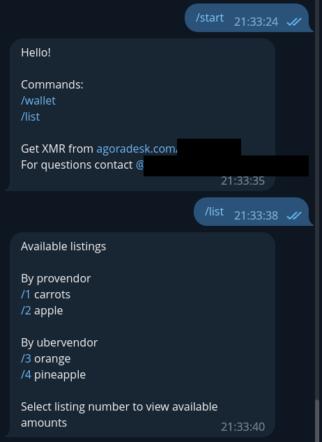
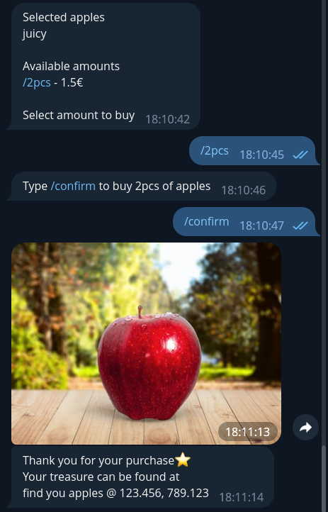
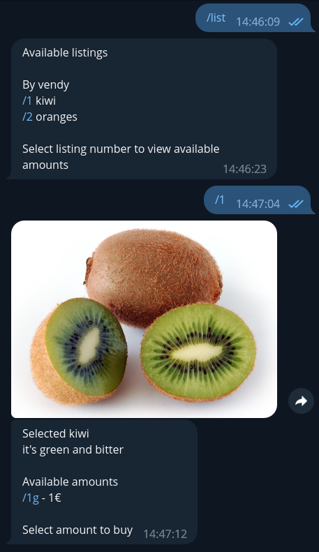
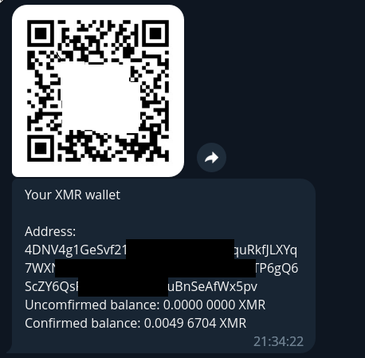
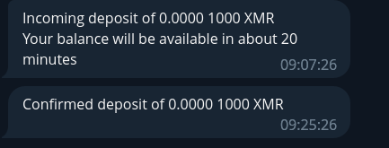
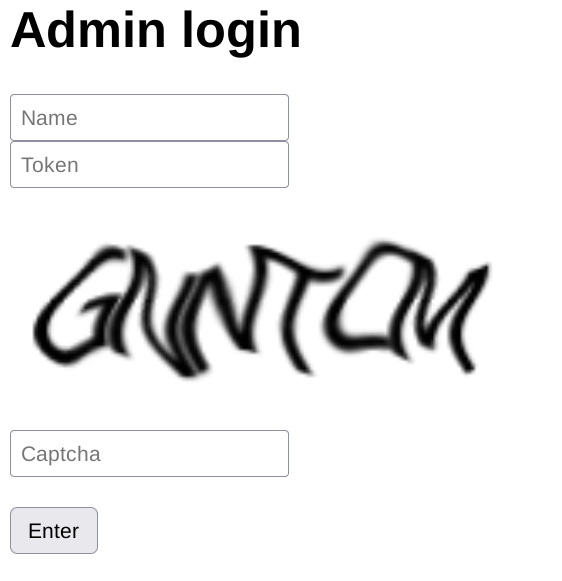
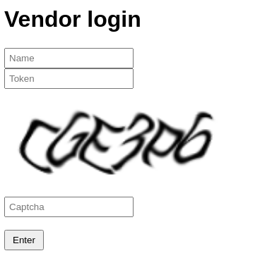
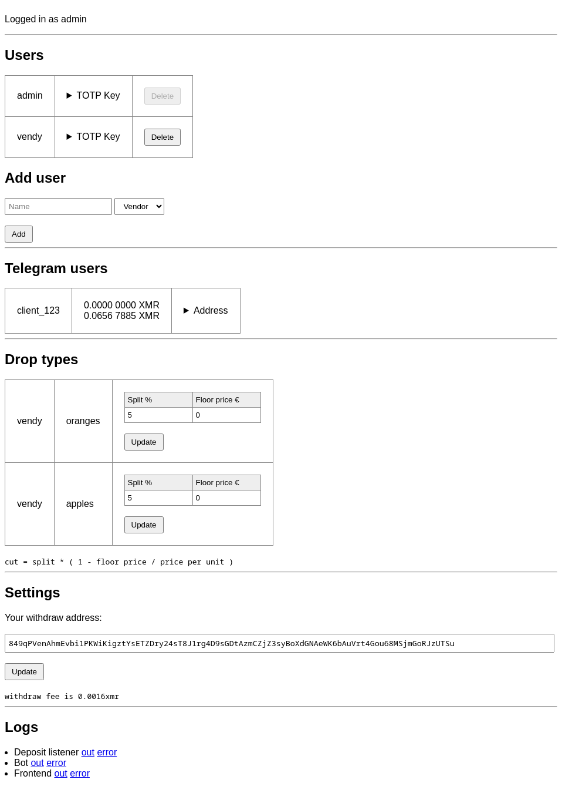
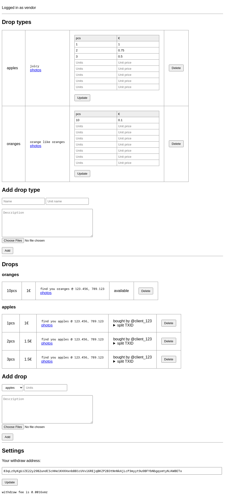

# Monero telegram shop bot

## Features

- monero based funding for clients to use shop
- web based interface for admins and vendors to
  - add new product types
  - add new products
  - set monero address to recieve funds when purchase is made
  - add new users
- automatic splitting and sending of funds between market and vendor after successful purchase

### Shopping
  

  

  

### Monero based funding to buy products

#### Deposit monero in telegram bot

#### Unconfirmed and confirmed deposit notification from bot

### Web based interface for admins and vendors

#### TOTP-based easy login solution

#### Admin web panel

#### Vendor web panel

